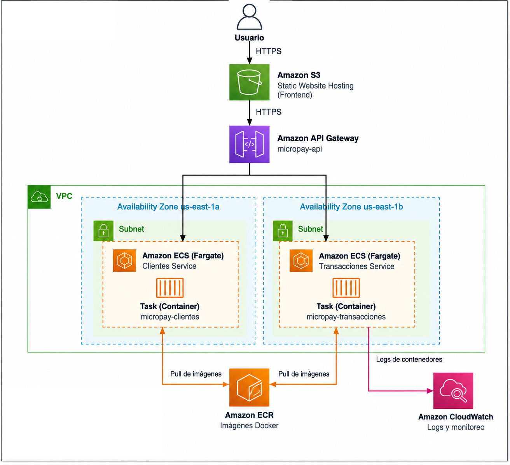
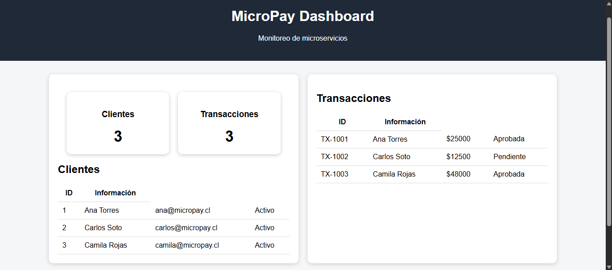
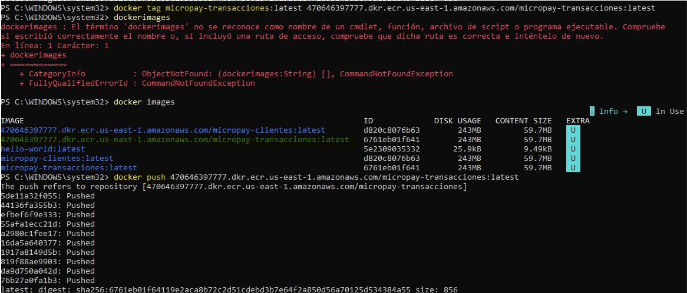
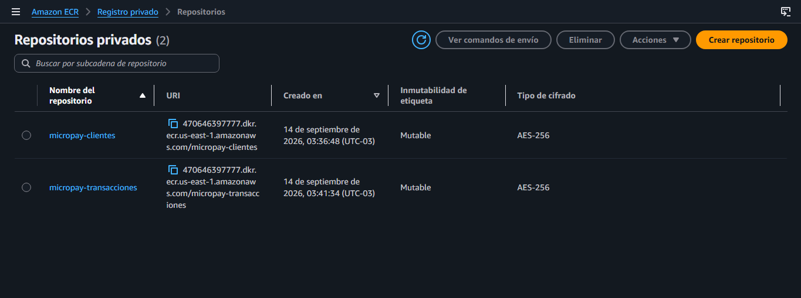
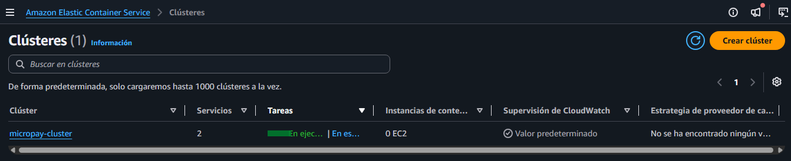
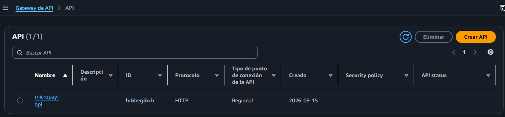
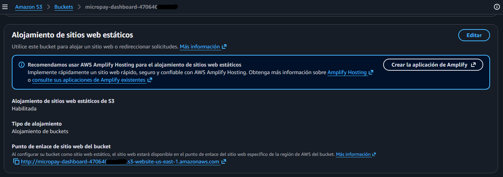
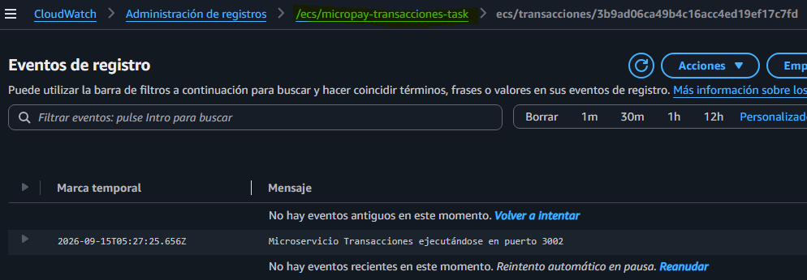
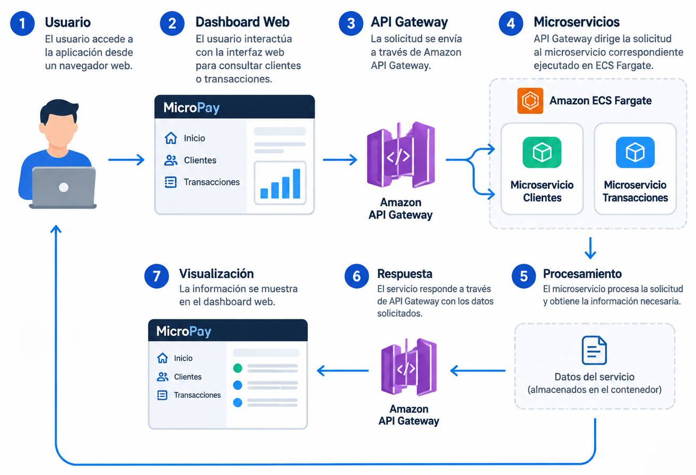

# ☁️ MicroPay - Arquitectura Cloud basada en Microservicios

## 📌 Descripción del proyecto

MicroPay es una aplicación basada en una arquitectura de microservicios, desarrollada utilizando Node.js, Express y Docker.

La solución permite gestionar información de clientes y transacciones mediante servicios independientes desplegados utilizando infraestructura cloud de AWS.

La arquitectura implementada considera:

- Dashboard web para interacción con el usuario.
- Microservicios backend independientes.
- Contenedores Docker para empaquetar los servicios.
- Servicios administrados de AWS para almacenamiento, ejecución y monitoreo.

---

# 🏗️ Arquitectura general

La solución está compuesta por los siguientes componentes:

- **Dashboard Web:** interfaz frontend encargada de visualizar la información del sistema.
- **Microservicio Clientes:** servicio backend encargado de gestionar información de clientes.
- **Microservicio Transacciones:** servicio backend encargado de gestionar información de transacciones.
- **Amazon S3:** almacenamiento y publicación del frontend estático.
- **Amazon ECR:** almacenamiento de imágenes Docker.
- **Amazon ECS Fargate:** ejecución de contenedores backend.
- **Amazon API Gateway:** exposición de servicios mediante endpoints REST.
- **Amazon CloudWatch:** monitoreo y registros de ejecución.

---

# 🌐 Interfaz Web

El proyecto incluye una interfaz frontend desarrollada con HTML, CSS y JavaScript.

El dashboard principal corresponde a la aplicación web preparada para integrarse con los servicios backend desplegados en AWS.

Adicionalmente, se incluye una versión demo utilizada como maqueta visual para mostrar la interfaz utilizando datos locales en formato JSON, sin depender de los servicios AWS activos.

Incluye:

- Visualización de clientes.
- Visualización de transacciones.
- Componentes visuales del sistema.
- Recursos estáticos necesarios para la interfaz.

---

# 🐳 Microservicios contenerizados con Docker

Los servicios backend fueron desarrollados como microservicios independientes utilizando Node.js y Express.

Cada servicio fue preparado utilizando Docker para facilitar su despliegue mediante contenedores.

Incluye:

- Código fuente de los microservicios `clientes` y `transacciones`.
- Archivo `Dockerfile` independiente para cada servicio.
- Archivos `.dockerignore`.
- Configuración de dependencias mediante `package.json`.

Las imágenes Docker generadas fueron almacenadas en Amazon ECR y posteriormente utilizadas para la ejecución de contenedores mediante Amazon ECS Fargate.

---

# 📦 Amazon ECR - Elastic Container Registry

Amazon ECR es utilizado como repositorio privado para almacenar las imágenes Docker correspondientes a los microservicios backend.

Permite:

- Almacenar imágenes Docker.
- Gestionar versiones de imágenes.
- Integrarse con Amazon ECS para el despliegue de contenedores.

---

# 🚀 Amazon ECS Fargate

Amazon ECS Fargate permite ejecutar los contenedores backend sin necesidad de administrar servidores.

Los servicios desplegados corresponden a:

- Microservicio Clientes.
- Microservicio Transacciones.

ECS Fargate permite administrar la ejecución de los contenedores utilizando las imágenes almacenadas previamente en Amazon ECR.

---

# 🔌 Amazon API Gateway

Amazon API Gateway funciona como punto de acceso para los servicios backend.

Permite publicar los endpoints REST utilizados por la aplicación y dirigir las solicitudes hacia los microservicios correspondientes desplegados en ECS Fargate.

---

# ☁️ Amazon S3 - Hosting del Dashboard Web

Amazon S3 es utilizado para almacenar y publicar los recursos estáticos correspondientes al frontend web.

Incluye:

- Archivos HTML.
- Archivos CSS.
- Archivos JavaScript.
- Recursos necesarios para la interfaz.

El bucket S3 permite alojar el dashboard web como contenido estático.

---

# 📊 Amazon CloudWatch

Amazon CloudWatch permite monitorear la ejecución de los servicios desplegados.

Incluye:

- Registros de ejecución de los contenedores.
- Seguimiento de eventos.
- Revisión de funcionamiento de los servicios.

---

# 🔄 Flujo de uso de la aplicación

El usuario interactúa con el dashboard web para consultar información del sistema.

La aplicación procesa las solicitudes mediante los servicios backend desplegados en AWS y entrega la información correspondiente nuevamente hacia la interfaz web.

---

# 🛠️ Tecnologías utilizadas

## Desarrollo

- Node.js
- Express
- HTML5
- CSS3
- JavaScript

## Contenedores

- Docker
- Dockerfile

## Servicios AWS

- Amazon S3
- Amazon ECR
- Amazon ECS Fargate
- Amazon API Gateway
- Amazon CloudWatch

